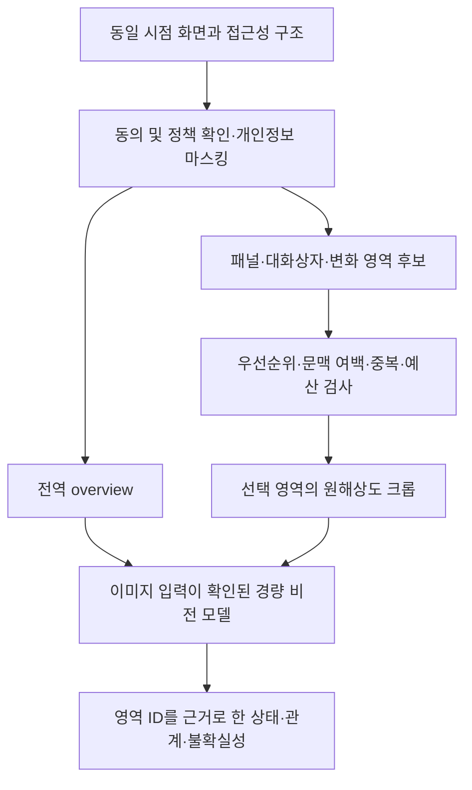

# Maekon 화면 영역 분할과 크롭 기반 이해 — 연구 및 구현 계약

조사일: 2026-09-09. 화면 영역 입력 처리 계약과 평가 설계.
현재 보고서의 제안과 논문 결과는 Maekon의 실제 모델·설치본 성능 측정이 아니다.

## 판단

사용자가 제안한 영역 분할과 크롭 분석의 결합은 타당한 후보 구조다. 다만 화면 전체를 먼저 작은 사각형으로 촘촘히 잘라 매번 모델에 보내는 방식에는 호출 비용, 문맥 소실, 중복 분석 문제가 있다. 화면의 전역 문맥을 남기고, 질문·포커스·변화와 관계있는 소수 영역을 원해상도로 추가하는 계층적 접근을 우선 비교한다.

여기서 구분해야 할 세 작업은 다음과 같다.

| 작업 | 필요한 결과 | 우선 후보 |
|---|---|---|
| UI 구조 파악 | 창, 대화상자, 패널, 표, 편집 영역과 포함 관계 | AX/UIA/AT-SPI 정보, 사각형·경계 검출, UI 전용 layout parser |
| 요소의 기능 이해 | 아이콘·버튼·메뉴의 역할과 현재 상태 | OCR/접근성 텍스트 + 선택 영역 VLM |
| 비정형 이미지 분할 | 캔버스·사진에서 물체의 정확한 픽셀 경계 | 필요한 경우 SAM 계열 mask |

픽셀 mask가 버튼의 기능이나 패널의 의미까지 알려주는 것은 아니다. 반대로 UI 사각형만으로 그림 속 대상을 정밀하게 분할할 수는 없다. 제품 질문에 필요한 수준을 골라 써야 한다.

## 1차 자료에서 얻은 근거

### UIED와 기본 컴퓨터 비전

UIED 관련 연구는 일반 사진 검출기를 그대로 적용할 때 생기는 GUI의 경계·배치 문제를 짚고, 화면의 큰 구조부터 세부 요소로 내려가는 방법과 텍스트 검출의 결합을 제안한다. 공식 구현도 비텍스트 위치 검출과 텍스트 검출을 분리하며 화면 유형별 파라미터가 달라진다고 명시한다. 오래된 연구지만 저비용 영역 제안의 대조군을 설계하는 근거다. 코드 전체를 현재 제품 의존성으로 바로 가져오지는 않는다. [논문](https://arxiv.org/abs/2008.05132), [공식 구현](https://github.com/MulongXie/UIED)

기본 연산으로는 색/밝기·경계 기반 이진화 후 연결 성분의 bbox, contour 계층, 사각형 근사를 이용할 수 있다. OpenCV는 이러한 연산을 제공하지만, 연결 성분 하나가 의미 있는 패널 하나라는 보장은 없다. 얇은 선·그림자·붙어 있는 텍스트 때문에 과분할/미분할되는 대조 입력으로 판단해야 한다. ONESHIM Rust에 OpenCV 의존성을 추가한 상태는 아니다. [OpenCV 구조 분석 API](https://docs.opencv.org/4.13.0/d3/dc0/group__imgproc__shape.html)

### OmniParser

원 논문은 인터랙션 가능한 영역 검출, OCR, 아이콘 기능 설명을 결합하고, 위치 표시와 지역 설명을 전역 스크린샷과 함께 사용한다. 이는 검출 위치와 의미 설명을 연결하는 근거다. Maekon에서도 모델이 임의 좌표를 생성하게 하기보다 검증된 region ID를 참조하도록 설계할 수 있다. [논문](https://arxiv.org/html/2408.00203v1)

현재 공식 저장소의 detector/caption 구현과 라이선스는 버전별로 다르다. 조사 시점에는 새 icon_detect_v3 경로와 HF PR revision 안내가 있으며 기존 Ultralytics 기반 가중치와 동일 조건으로 볼 수 없다. 도입 실험은 코드·가중치 revision과 해당 라이선스를 고정한 뒤 별도 범위에서 수행한다. 다운로드나 실행은 하지 않았다. [공식 저장소](https://github.com/microsoft/OmniParser)

### ScreenSpot-Pro / ScreenSeekeR / ReGround

고해상도 전문 프로그램의 **목표 위치 찾기** 연구다. 논문의 OS-Atlas-7B 비교에서는 기본 18.9%, 한 번의 재크롭·재탐색 ReGround 40.2%, ScreenSeekeR 48.1%를 보고한다. 이 값은 OCR CER나 화면 설명 품질도, Maekon 결과도 아니다. 크롭 크기 실험의 최적값은 모델별로 달랐으며, 작은 크롭의 문맥 부족과 잘못 선택한 첫 영역에서 벗어나지 못하는 실패를 보여준다. 따라서 한 고정 크기를 보편적 정답으로 채택하지 않는다. [논문, 특히 4.2·5.2·5.3절](https://arxiv.org/html/2504.07981v1)

### ScreenAI

텍스트·이미지·UI 요소의 위치, 종류, 설명과 계층을 함께 다루는 화면 annotation 접근이다. Maekon의 출력도 OCR 문자열 목록에 머무르지 않고 화면 유형과 패널 관계, 근거 요소를 포함할 필요가 있다는 참고 근거다. 모델의 공개·제품 사용 가능성이나 우리 설치본 성능을 확인한 것은 아니다. [Google Research](https://research.google/blog/screenai-a-visual-language-model-for-ui-and-visually-situated-language-understanding/)

### SAM 3 / 3.1

텍스트·예시·시각 프롬프트에 맞는 객체를 검출·분할·추적하는 계열이다. 캔버스·사진의 비정형 객체에 후보로 둔다. SAM 3.1의 H100 처리량을 일반 Mac/Windows PC 처리량으로 가져오지 않으며, 모든 UI 프레임에 큰 segmentation 모델을 상시 실행할 근거로 사용하지 않는다. [논문](https://arxiv.org/abs/2511.16719), [Meta의 3.1 업데이트](https://ai.meta.com/blog/segment-anything-model-3/)

## 제안하는 제품 흐름

위 흐름은 목표 계약이다. 현재 전체 경로가 연결됐다는 의미가 아니다.

1. OS adapter는 캡처와 접근성 구조를 제공한다. macOS는 AX, Windows는 UIA, Linux는 AT-SPI 정보가 있을 때 활용하고, unavailable은 정상적인 별도 상태로 남긴다.
2. 처음에는 기존 영역·창 경계를 활용한다. 텍스트·배경·직선·연결 성분으로 만든 싼 시각 후보는 반복 패널/그림자/투명창/다크모드에서 후보 recall을 먼저 측정한다. OCR bbox를 모았다는 이유만으로 패널 segmentation이 완성됐다고 하지 않는다.
3. 분석할 후보는 질문, 포커스, 변화와 관계있는 순서로 정한다. 작은 요소가 속한 패널이나 주변 레이블까지 담는 여백을 준다. 무관한 두 변화의 합집합을 무조건 하나의 큰 크롭으로 만들지 않는다.
4. overview는 항상 함께 유지한다. 선택 실패·후보 없음에서는 overview-only로 남고, 그 결과에 충분한 근거가 없으면 unknown 또는 제한된 추가 탐색을 반환한다.
5. 공급자가 여러 이미지를 실제로 받을 수 있으면 overview와 크롭을 구조화해 보낸다. 단일 이미지 입력만 검증된 경로라면 ID를 가진 contact sheet도 비교하되 재축소·레이블 가림을 평가한다. CLI의 이미지 파일 읽기/권한은 실제 invocation으로 검증한다.
6. OCR/접근성은 정확한 문자열과 좌표의 근거로, VLM은 의미와 관계의 해석에 사용한다. VLM이 모르는 위치를 OCR 계약의 0×0 박스나 임의 숫자로 채워 넣지 않는다.

## 현재 소스와 연결 지점

- `maekon-vision/src/gui_detector/`: OCR·입력의 상관 관계와 GUI 요소 크롭이 있다. 의미 있는 패널 분할 전체를 제공하는 것은 아니다.
- `native_detect/`: macOS 사각형 adapter가 있고, 비 macOS `OcrBboxFallback::detect_rectangles`는 현재 빈 배열을 반환한다. 동일한 segmentation을 세 OS가 이미 제공한다고 볼 수 없다.
- `delta.rs`: 바뀐 타일들의 합집합 경계가 있다. 멀리 떨어진 변화 두 곳은 큰 사각형이 될 수 있다는 소스상 우려다. 이 문서에서 성능을 측정한 것은 아니다.
- `maekon-core/src/models/frame.rs`: `ImagePayload::Delta.data`는 **전체 프레임**이며 region은 진단 메타데이터다. 이를 cropped patch로 바꾸면 기존 소비 계약이 깨진다.
- `src-tauri/src/commands/suggestions/current_context.rs`: 해당 현재 화면 suggestion의 session message는 텍스트 context와 빈 attachment를 보낸다. 다른 conversation 경로 전체가 이미지 미지원이라는 뜻은 아니다.
- `subprocess_provider/ocr_provider.rs`: Codex 경로는 명시적 image 인자를 사용한다. Claude/Gemini의 파일 경로 기반 입력과 이미지 접근 권한은 동일하게 보장되지 않는다. 이전 subscription 검토의 실제 호출 미실행 상태를 유지한다.

## 전체 입력 준비 계층의 계약

`prepare_screen_regions`는 한 프레임과 우선순위 순서의 후보 사각형을 받아 overview + 선택 크롭을 함께 구성하는 로컬 API다. 검증된 단일 크롭과 overview API를 재사용하며 아래 정책을 적용한다.

- 후보 인덱스, 원본 픽셀 기준 크롭 경계, 생성된 이미지 크기를 함께 반환한다.
- 입력/후보 개수와 출력 pixel budget을 검사한다. overview를 우선 배정하며, 크롭을 원해상도로 담지 못하면 조용히 축소하지 않고 예산 제외로 기록한다.
- zero/overflow/out-of-frame 후보를 제외한다. 유효한 후보에 적용하는 padding만 프레임 경계에 맞춰 자른다.
- padding 후 경계가 정확히 같은 크롭만 중복으로 제외한다. 큰 패널에 포함된 작은 요소도 별도 크롭으로 유지한다. 공급자가 큰 이미지를 내부 축소하면 원본 픽셀이 포함되어 있다는 사실만으로 세부 정보 보존을 보장할 수 없기 때문이다.
- 후보 없음/전부 거부에서도 overview를 유지한다.
- screenshot capture, raw 이미지 저장, 캐시, 모델 실행, 외부 전송을 하지 않는다.

이는 영상 segmentation detector나 모델 provider port를 새로 완성하는 이슈가 아니다. UI/runtime 소비 연결 전의 검증 가능한 입력 준비 경계를 먼저 구현한다. 앱의 주 경로에 연결할 때에는 별도 Claim으로 실제 소비자와 egress를 포함해야 한다.

## 후속 runtime 계약

동일 capture generation, 프레임 식별, 정책 revision, 원본 이미지와 변환 정보를 결속한다. 오래된 후보를 새 프레임에 적용하는 상황은 실패로 처리한다. crop-local pixel → source-image pixel → OS logical/screen 좌표 변환을 분리하고 DPI·음수 모니터 원점을 추정하지 않는다.

마스킹은 overview와 크롭 생성보다 먼저 같은 원본에 적용한다. API의 메모리 이미지 변환 성공은 consent나 egress 허가를 뜻하지 않는다. 모델 호출 직전 기존 정책을 다시 검증하고, 철회된 프레임/크롭 캐시를 재사용하지 않는다. 이 책임은 캡처 및 provider 실행 계층에서 함께 검증한다.

## 실제 품질 비교 계획

동일 모델 revision, 입력 화면, 질문, 답변 schema 및 출력 budget에서 비교한다. 전체 입력 pixel/call 제한은 맞추고 각 방법이 실제 사용한 양도 기록한다.

| 비교군 | 목적 |
|---|---|
| 전체 화면만 | 기본 대조군 |
| 동일한 규칙의 균일 타일 + overview | 선택 알고리즘 자체의 기여 분리 |
| 선택 크롭 + overview | 주 후보 |
| 선택 크롭만 | 전역 문맥 제거 대조 |
| 필요한 사례에만 mask 추가 | 비정형 객체의 추가 이득/비용 |

후보 단계는 target coverage/recall과 잘못된 영역 선택 비율을 본다. 분석 단계는 정확한 문자열·필드, 화면 상태와 관계의 정답, 존재하지 않는 근거/확신, unknown을 분리한다. 전체 단계는 호출수, 입력 pixel/실제 token, wall time p50/p95, 실패·denied·unavailable·재시도를 모두 센다. 평균 하나 대신 한글/작은 글자/다크모드/HiDPI/중복 패널/그림·캔버스별로 나눈다.

반증 입력:
- 이미지 교체·빈 이미지·정답과 무관한 크롭에서 같은 답을 내는지 확인한다.
- 근거가 crop 밖의 레이블에만 있는 사례로 overview의 필요성을 검사한다.
- 후보가 놓친 목표, 중복된 좌우 패널, 두 개의 먼 변경을 포함한다.
- policy 철회·stale frame·잘못된 DPI·overflow는 정상 분석으로 집계하지 않는다.
- 손으로 심은 crop offset/overview 누락 결함에서 검사가 실제 실패하는지 확인한다.

한 번 실행한 Test 표본과 정답은 동결 상태로 보존한다. 새 평가 corpus의 family split과 질문/정답은 실행 전 고정한다. 개발 입력에서 방법을 선택한 뒤 별도 holdout을 실행한다. synthetic/helper, 실제 모델, 설치본 end-to-end, 사용자의 과업 성공은 서로 다른 증거다.

## 구현과 검증 경계

기본 API인 `maekon_vision::screen_regions::prepare_screen_region`은 단일 크롭을 준비한다. 한 프레임, 검증할 후보 사각형, 원 후보 인덱스와 남은 pixel budget을 받아 원해상도 크롭 하나를 만든다. 원본 픽셀 좌표와 이미지의 결속을 보존하고, zero/overflow/out-of-frame 후보와 예산 초과는 구체적인 오류로 거부한다. 유효하지 않은 크롭을 조용히 자르거나 축소하지 않는다. 전체 요청 예산과 동일 frame/policy 확인은 호출자의 책임이다.

`prepare_screen_overview`는 같은 프레임의 전체 화면 축소본과 원본 크기를 결속한다. 최대 변 길이, 원본 픽셀 예산, 출력 픽셀 예산을 받아 검증하며 원본 크기는 64,000,000픽셀, 최대 변 길이는 4096픽셀로 제한한다. 호출자는 원본 예산을 더 낮출 수 있다. 이미 작은 프레임은 확대하지 않고, 축소 시 Triangle 필터를 사용한다. 각 축의 크기를 내림하고 최소 1픽셀로 유지하므로 홀수 크기·극단적인 종횡비에는 1픽셀 이내의 반올림 차이가 생긴다. 원본을 잘라내거나 예산에 맞춰 overview를 추가 축소하지 않으며, 요청한 전체 축소본을 담을 예산이 없으면 오류로 거부한다.

축소본에는 native crop과 같은 1:1 좌표 환산을 제공하지 않는다. 원본 크기와 실제 overview 크기는 별도로 확인할 수 있다. 이 API의 예산은 원본·반환 이미지의 픽셀 수를 제한하며 이미 할당된 입력을 포함한 peak memory나 모델 과금 상한을 보장하지 않는다. 두 기본 API를 개별 호출할 때 합산 예산 및 같은 frame/policy 확인은 호출자의 책임이다. `prepare_screen_regions`로 함께 구성하면 반환 overview와 크롭의 합산 픽셀 예산은 이 계층이 검사한다.

`padded_region_bounds`는 원본 후보가 화면 안의 유효한 사각형인지 먼저 검증한 뒤, 여백으로 추가한 문맥만 화면 경계에 맞춰 제한한다. zero-area·overflow·out-of-frame 후보와 빈 화면은 `None`으로 거부하며 큰 padding으로 잘못된 후보를 보정하지 않는다. 이미지 할당 없이 픽셀 좌표만 계산하므로 같은 프레임의 실제 크기를 전달해야 한다. 반환한 경계는 명시적인 픽셀 예산과 함께 `prepare_screen_region`에 바로 사용할 수 있다. 합성 검사는 각 변과 모서리, 최대 정수, 잘못된 후보의 거부와 실제 크롭 픽셀의 연결을 확인한다.

`prepare_screen_regions(frame, candidates, options)`는 같은 프레임에서 먼저 overview를 만들고 그 픽셀 수를 총 예산에서 예약한다. `candidates`는 호출자가 중요도 순서로 정렬한 원본 픽셀 사각형이며 API가 의미상 우선순위를 새로 추정하지 않는다. 원본 후보를 검증한 뒤 padding을 적용하고, 이미 포함된 크롭과 padding 후 경계가 정확히 같을 때만 중복 처리한다. 중복은 개수·예산 상한에 도달한 뒤에도 포함된 크롭 인덱스를 가리킨다. 중첩된 부모 패널과 작은 요소, 부분적으로 겹치는 영역은 별도 크롭으로 유지한다.

`ScreenRegionOptions`의 기본값은 overview 최대 변 512픽셀, 크롭 4개, 총 출력 4,000,000픽셀, padding 16픽셀이다. 원본은 64,000,000픽셀, 후보는 4096개, overview 최대 변은 4096픽셀, 크롭은 16개, 총 출력은 16,000,000픽셀 이하로 제한한다. 크롭 개수 0은 명시적인 overview-only 모드다. 후보가 없거나 모두 제외되어도 유효한 overview를 반환하며, overview 자체가 예산에 들어가지 않으면 전체 요청을 오류로 거부한다. 이는 반환 픽셀 수 상한이며 peak memory·전송 bytes·모델 token 비용 상한은 아니다.

`PreparedScreenRegions`는 원본 크기, overview, 크롭, 총 반환 픽셀 수와 후보별 `RegionDecision`을 불변 조회로 제공한다. 결과는 입력 후보 순서를 보존하고 크롭은 원 후보 인덱스를 유지한다. 유효하지 않거나 예산보다 큰 후보를 건너뛴 뒤에도 뒤의 후보를 검사한다.

| 후보 결과 | 의미 |
|---|---|
| `Included { crop_index }` | 해당 출력 크롭에 포함됨 |
| `InvalidBounds` | padding 전 zero/overflow/out-of-frame 후보 |
| `DuplicateOf { crop_index }` | 이미 포함된 크롭과 padding 후 경계가 동일함 |
| `CropLimit` | 허용 크롭 개수를 소진함 |
| `PixelBudget` | 원해상도와 padding을 포함한 크롭이 남은 픽셀 예산을 초과함 |

현재 로컬 구현은 후보 입력을 받는 이미지 준비 계층이다. 자동 영역 검출, 의미 기반 후보 우선순위 산정, 실제 모델 분석과 runtime 연결은 별도 작업이다. PR 게시·병합 상태 및 설치본 적용 여부와 구분한다.

`tests/screen_regions.rs`의 합성 입력 검사는 픽셀·좌표·단일 크롭 예산, overview의 문맥·비율·예산·원본 불변성에 더해 후보 순서, padding overflow, 정확 중복과 중첩 영역의 구분, 합산 예산 경계, 뒤쪽 유효 후보, 개수 상한 및 이미지 교체 반례를 검증한다. 실제 모델 또는 설치본 품질 점수는 산출하지 않는다. 모델 다운로드·호출·실사용자 화면 수집·외부 이미지 전송은 이 계층의 범위에 포함하지 않는다.
